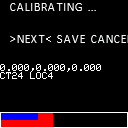

# Calibrating the IMU (Accelerometer)

In the menu navigate to : 

**OPTIONS > SETTINGS > SENSORS > IMU**

The calibration is done by moving the device through 12 different positions, 
the order in which it is done is not important nor the exact positioning,
the important thing is that the device stays perfectly stable 
during IMU measurement on each of those 12 positions.

You can use the 6 flat sides of the devices and rest the device at +/-45 degrees on 6 of its edges.

Once stabilized on a positioning move the slider upwards. You'll see a blue bar counting down.
During that count down various IMU readings are taken for calibration.
A _red progress bar_ will more forward until all 12 position are covered.

At the end, in the menu, select _**Validate**_, than _**Calculate**_.
This will display the result of the calibration, you can ignore the values displayed in the next screens and finish with **_Save_** the calibration.

