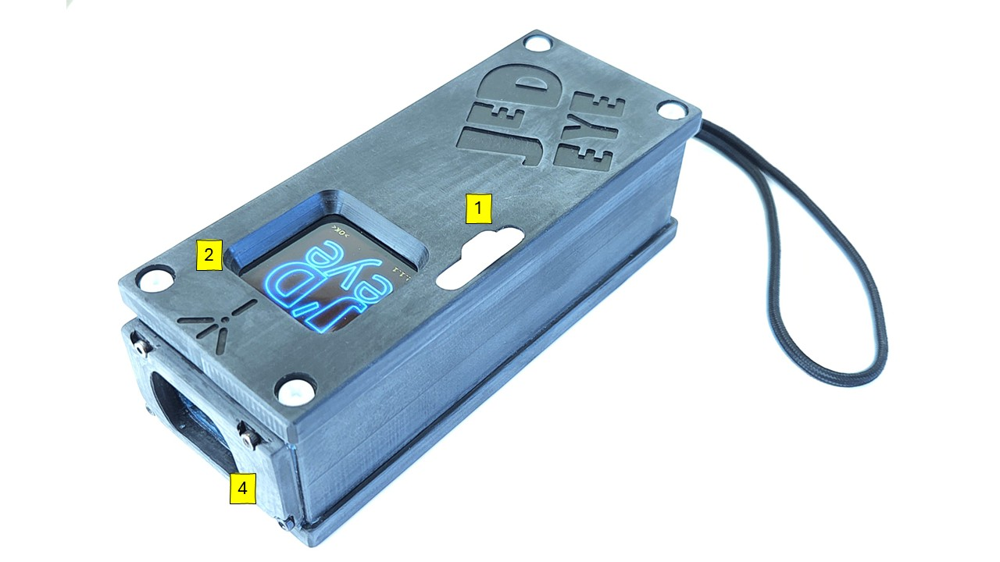
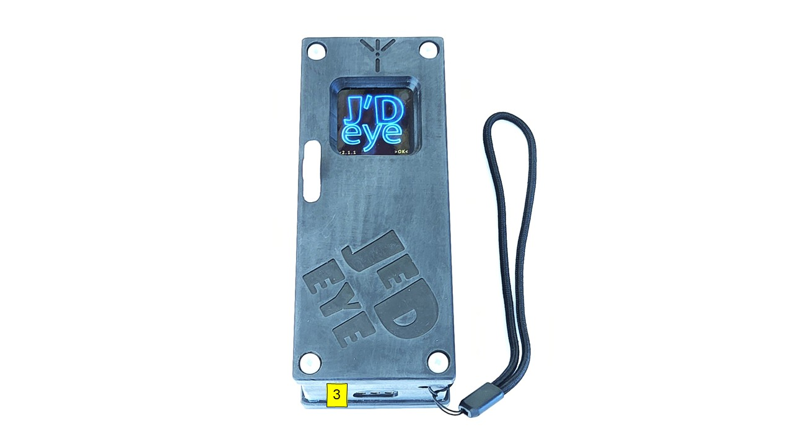

# Device Description

Thank you for choosing the [JedEye](https://www.arianesline.com/mnemo/)!
Below is a brief overview of the device's main components.

### 1 - Slider Control
This slider is the primary interface for interacting with the JedEye.
- Moving the slider **Up** corresponds to an **Enter** or **Select** command.
- Moving the slider **Down** corresponds to a **Next** or **Scroll** command.

### 2 - Display
The device features an OLED graphical color display. The text, icons, and background colors will guide you through the survey process.

### 3 - USB Port
This port connects the device to a 5V USB charger. It is also used to connect the device to your computer for firmware updates.
> Data download via USB is possible but not recommended. The preferred method is via Wi-Fi.

### 4 - Laser Window
The LIDAR emits laser light (CLASS-II) through this opening.
> Class II laser safety relies on the human blink reflex to protect eyes from low-power, visible light (400-700nm) up to 1 milliwatt (mW), making unintentional exposure generally safe due to the quick eyelid closure (around 0.25s) that limits exposure time. However, they're not toys; intentional staring or resisting the blink reflex can cause temporary flash blindness, afterimages, glare, and even permanent eye damage, requiring responsible use

> **Maintenance**: Clean the laser window only with flowing water. **NEVER** use chemicals, solvents, or abrasive cloths.

