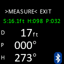

# Distance Meter

The **Distance Meter** is a tool that allows you to use the JedEye's sensors (Lidar and IMU) to measure distance, azimuth, and pitch in real-time without recording the data as a shot in a survey.

## Access
Navigate to **OPTIONS > TOOLS > DISTANCE METER** in the main menu.

## Interface
When active, the screen displays the real-time readings from the sensors:
- **Distance**: Distance to the target in the selected unit.
- **Azimuth**: Magnetic heading (compass bearing).
- **Pitch**: Vertical angle (inclination).
  

In the menu you can choose:
- **MEASURE**: Capture the current readings and broadcasts it on Bluetooth
- **EXIT**: Return to the **Tools** menu.

## Usage

### taking a Measurement
1. Aim the device at the target.
2. Ensure the **MEASURE** option is selected (use the **Next** button to toggle if needed).
3. Press the **Select** button.
   - The screen will flash white briefly to confirm the action.
   - The "Saved" values on the screen will update to the captured readings.
   - The captured values (Distance, Azimuth, Pitch) are broadcasted via Bluetooth Low Energy (BLE) to any connected device.

### Exiting
1. Press the **Next** button to select **EXIT**.
2. Press the **Select** button to leave the Distance Meter mode.

## Bluetooth Broadcasting

While in Distance Meter mode, the JedEye advertises a Bluetooth Low Energy service so survey apps can collect each captured shot in real time. WiFi is turned off automatically when you enter this mode (the radio module does either WiFi or BLE, never both).

The device advertises itself as `JedEye_<serial>`, where `<serial>` is the 16-hex-digit unique ID of the underlying processor (e.g. `JedEye_009315501C7B8A58`).

A small Bluetooth icon appears in the bottom-right corner of the screen when BLE advertising is active.

### TopoDroid integration

JedEye is supported as a first-class device in [TopoDroid](https://github.com/marcocorvi/topodroid) (cave surveying app for Android).

1. On the JedEye, enter the **Distance Meter** screen so it begins advertising.
2. In TopoDroid, open the **Device** screen and run **BT Scan** from the menu. The JedEye appears in the list with model "JedEye".
3. Tap the entry to register it. The pairing only needs to be done once; subsequent connections happen automatically whenever the JedEye is in Distance Meter mode.

Once paired:

- Each measurement you capture on the JedEye (by selecting **MEASURE**) is streamed to TopoDroid as a single shot — distance, azimuth, clino, and roll — and lands directly in the survey's shot list with auto-assigned station names.
- TopoDroid can also send a remote **MEASURE** command from the app side, which triggers a capture on the JedEye without touching the device. Useful when the JedEye is mounted on a tripod.
- The JedEye uses continuous streaming only: shots taken while not connected are **not** buffered and re-transmitted later. Connect TopoDroid before capturing if you want the shots to land in the survey.

### Protocol details

For app authors who want to consume the shot stream directly without going through TopoDroid:

| Item | UUID | Properties | Format |
| :--- | :--- | :--- | :--- |
| Service | `4A454445-5945-0001-8000-00805F9B34FB` | — | — |
| Shot notification | `4A454445-5945-0002-8000-00805F9B34FB` | Read + Notify | 17 bytes |
| Command write | `4A454445-5945-0003-8000-00805F9B34FB` | Write / WriteWithoutResponse | 1 byte |

Each shot notification is 17 bytes: a 1-byte sequence number followed by four little-endian IEEE-754 `float32` values — bearing in degrees, clino in degrees, roll in degrees, distance in metres (in that order). This is the same shot-frame layout as the SAP6 instrument; only the GATT service UUIDs differ.

Single-byte commands accepted on the command characteristic:

| Code | Meaning |
| :--- | :--- |
| `0x36` | Laser on (start the lidar) |
| `0x37` | Laser off (stop the lidar) |
| `0x38` | Trigger a measurement and emit a shot notification |
| `0x30` / `0x31` | Calibration off / on — reserved, currently no-op |
| `0x34` | Device off — reserved, currently no-op |

> **NINA firmware requirement.** The TopoDroid-compatible BLE protocol requires NINA radio firmware **3.0.1** or newer. Devices shipped with firmware older than v2.3 carry NINA firmware 1.5.0 and need a one-time radio firmware update — see [Updating the NINA firmware](./Updating-the-NINA-firmware) for the walk-through.

