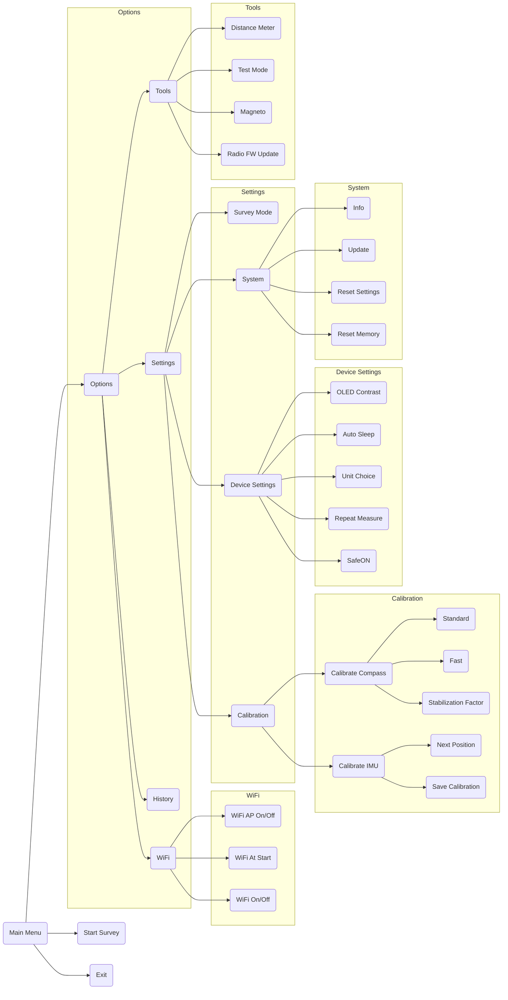

# Menu Tree Visual

```mermaid
graph LR
    Main(Main Menu)
    Start(Start Survey)
    Options(Options)
    Exit(Exit)

    Main --> Start
    Main --> Options
    Main --> Exit

    %% Options Submenu
    subgraph OptionsMenu [Options]
        direction TB
        WiFi(WiFi)
        Settings(Settings)
        History(History)
        Tools(Tools)

        Options --> WiFi
        Options --> Settings
        Options --> History
        Options --> Tools
    end

    %% WiFi Submenu
    subgraph WiFiMenu [WiFi]
        direction TB
        WAP(WiFi AP On/Off)
        WStart(WiFi At Start)
        WOn(WiFi On/Off)
        
        WiFi --> WAP
        WiFi --> WStart
        WiFi --> WOn
    end
    
    %% Settings Submenu
    subgraph SettingsMenu [Settings]
        direction TB
        SurveyMode(Survey Mode)
        Calibration(Calibration)
        DevSet(Device Settings)
        System(System)
        
        Settings --> SurveyMode
        Settings --> Calibration
        Settings --> DevSet
        Settings --> System
    end
    
    %% Calibration Submenu
    subgraph CalibrationMenu [Calibration]
        direction TB
        CalCompass(Calibrate Compass)
        CalIMU(Calibrate IMU)
        
        Calibration --> CalCompass
        Calibration --> CalIMU
        
        CalCompass --> CalCompStd(Standard)
        CalCompass --> CalCompFast(Fast)
        CalCompass --> StabFactor(Stabilization Factor)
        
        CalIMU --> NextPos(Next Position)
        CalIMU --> SaveCalIMU(Save Calibration)
    end
    
    %% Device Settings Submenu
    subgraph DeviceSettingsMenu [Device Settings]
        direction TB
        Contrast(OLED Contrast)
        AutoSleep(Auto Sleep)
        Unit(Unit Choice)
        RepMeas(Repeat Measure)
        SafeON(SafeON)
        
        DevSet --> Contrast
        DevSet --> AutoSleep
        DevSet --> Unit
        DevSet --> RepMeas
        DevSet --> SafeON

    end
    
    %% System Submenu
    subgraph SystemMenu [System]
        direction TB
        SysInfo(Info)
        Update(Update)
        ResetSet(Reset Settings)
        ResetMem(Reset Memory)
        
        System --> SysInfo
        System --> Update
        System --> ResetSet
        System --> ResetMem
    end

    
    %% Tools Submenu
    subgraph ToolsMenu [Tools]
        direction TB
        DistMeter(Distance Meter)
        TestMode(Test Mode)
        Magneto(Magneto)
        RadioFW(Radio FW Update)

        Tools --> DistMeter
        Tools --> TestMode
        Tools --> Magneto
        Tools --> RadioFW
    end
```

