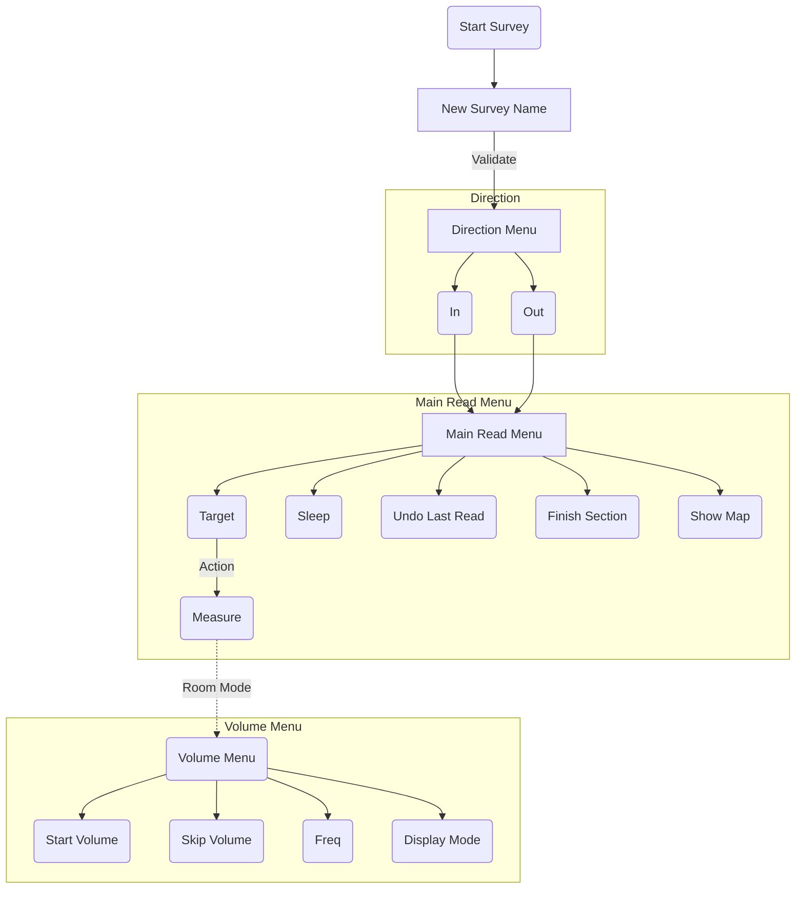

# Survey Flow and Overview

There are two modes of survey, the Line mode and the Room mode.
You select the one used by the device in the **OPTIONS > SETTINGS > SURVEY MODE(...)**

In the **_Line mode_** you survey an imaginary line going through the cave.
This line will be composed by straight segments, forming a continuous chain. 
A _**Shot**_ in that context will be a segment of that line.
A **_Station_** will be the connection point of of two shots. 
A collection of continuous shots will be a **_Section_**.
Each section has a direction (IN or OUT) and a name (3 Letters)

In the **_Room mode_**, you survey a line as you would do in the Line mode but you'll get
also the opportunity to take measurements at each station of the surrounding volume. The survey of that volume can be skipped.

