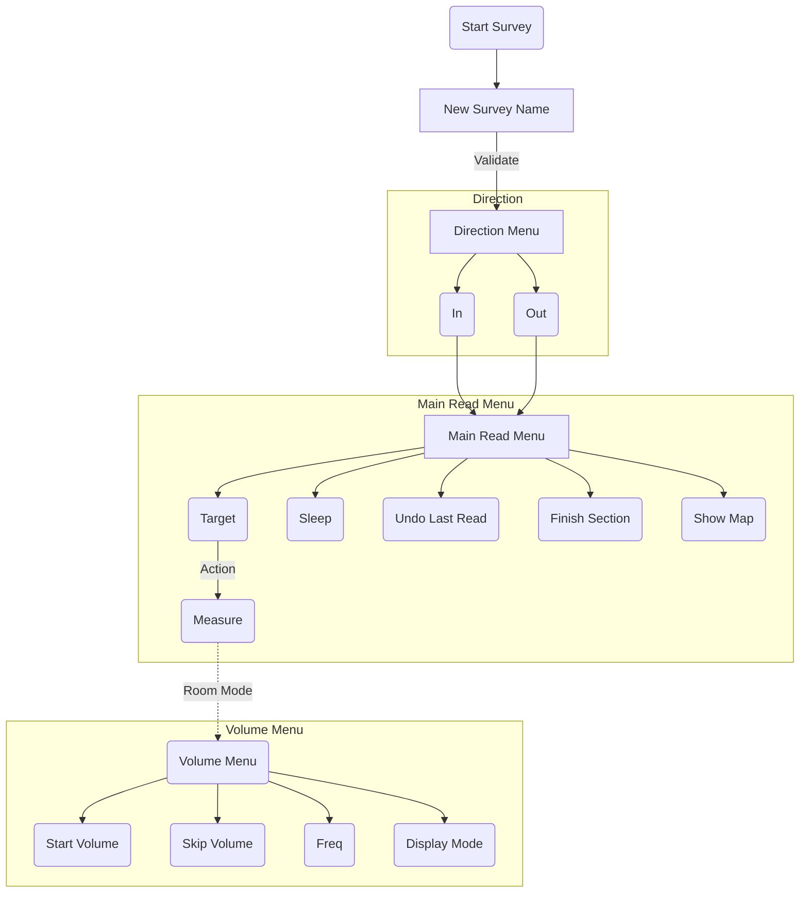

# Survey Flow

```mermaid
graph TD
    Start(Start Survey) --> NewSurvey[New Survey Name]
    NewSurvey -->|Validate| DirMenu[Direction Menu]
    
    subgraph Direction
        DirMenu --> InSurvey(In)
        DirMenu --> OutSurvey(Out)
    end
    
    InSurvey --> MainRead[Main Read Menu]
    OutSurvey --> MainRead
    
    subgraph ReadMenu [Main Read Menu]
        MainRead --> Target(Target)
        MainRead --> Sleep(Sleep)
        MainRead --> Undo(Undo Last Read)
        MainRead --> EndSection(Finish Section)
        MainRead --> ShowMap(Show Map)
        
        Target -->|Action| Measure(Measure)
    end
    
    subgraph VolumeMenu [Volume Menu]
        Measure -.->|Room Mode| Volume(Volume Menu)
        Volume --> StartVol(Start Volume)
        Volume --> SkipVol(Skip Volume)
        Volume --> Freq(Freq)
        Volume --> DispMode(Display Mode)
    end
```

