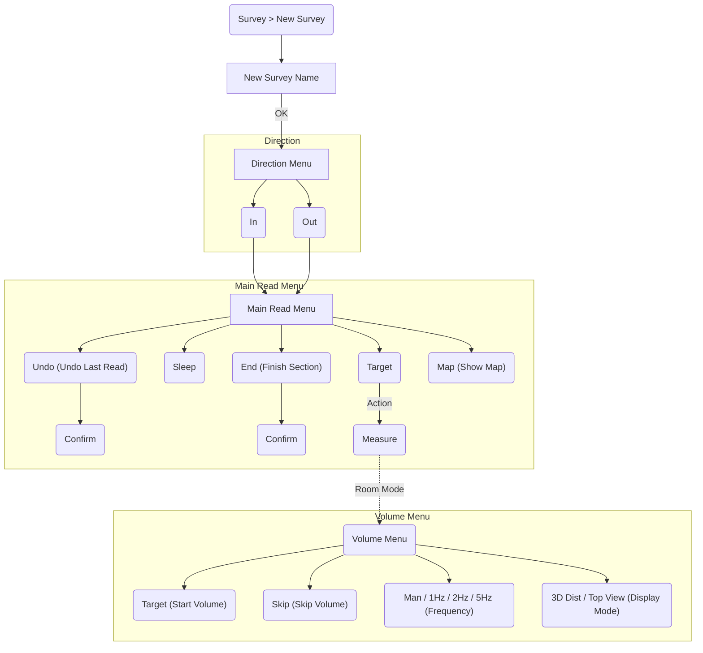

# Survey Flow

Each entry shows what the JedEye's screen reads, with what it does in brackets. **UNDO** and **END** each ask to
**CONFIRM**, with the cursor on **BACK**.

```mermaid
graph TD
    Start("Survey > New Survey") --> NewSurvey[New Survey Name]
    NewSurvey -->|OK| DirMenu[Direction Menu]
    
    subgraph Direction
        DirMenu --> InSurvey(In)
        DirMenu --> OutSurvey(Out)
    end
    
    InSurvey --> MainRead[Main Read Menu]
    OutSurvey --> MainRead
    
    subgraph ReadMenu [Main Read Menu]
        MainRead --> Target(Target)
        MainRead --> Sleep(Sleep)
        MainRead --> Undo("Undo (Undo Last Read)")
        MainRead --> EndSection("End (Finish Section)")
        MainRead --> ShowMap("Map (Show Map)")
        
        Undo --> ConfirmUndo(Confirm)
        EndSection --> ConfirmEnd(Confirm)
        
        Target -->|Action| Measure(Measure)
    end
    
    subgraph VolumeMenu [Volume Menu]
        Measure -.->|Room Mode| Volume(Volume Menu)
        Volume --> StartVol("Target (Start Volume)")
        Volume --> SkipVol("Skip (Skip Volume)")
        Volume --> Freq("Man / 1Hz / 2Hz / 5Hz (Frequency)")
        Volume --> DispMode("3D Dist / Top View (Display Mode)")
    end
```

