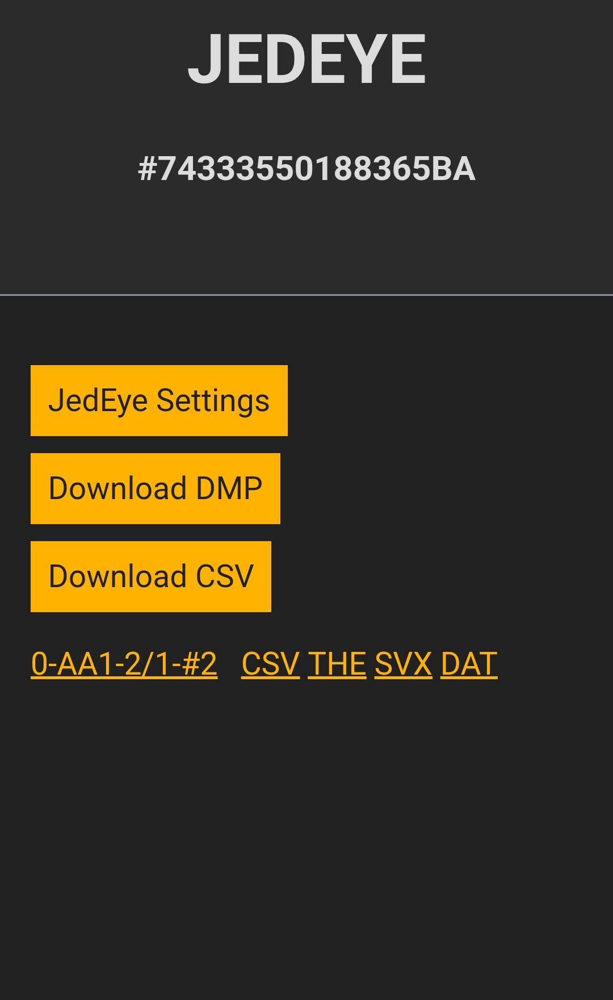

# Wireless Data transfer

## The JedEye as Wireless Access Point ##

Navigate to OPTIONS > WIFI > WIFI AP(OFF) and select the entry.
This will create a wifi network to which you can connect any of your devices equipped with a webbrowser.
When the wifi is on an icon  will be displayed in the upper croner of the screen.
If not connection occur during 5 min the wifi will automatically turn off to save battery.

In the OPTIONS > WIFI menu you'll find an entry called Wifi Start. When this is on the Wifi will be automatically on during 30s when the device starts. If no connection happens it will turn off.

The wireless network created is _( SSID: **JedEye** Password: **password**)_, connect your device 
and navigate to http://192.168.4.1 (as displayed below the main menu).

This is the landing page on a phone:

From this web interface, you can download your survey data in various formats:
*   **Download DMP**: Raw memory dump for backup/debugging.
*   **Download CSV**: Comma-Separated Values file for general use.
*   **Download THE**: Therion export file.
*   **Download SVX**: Survex export file.

You can also download individual surveys by clicking the links next to each entry in the history list.